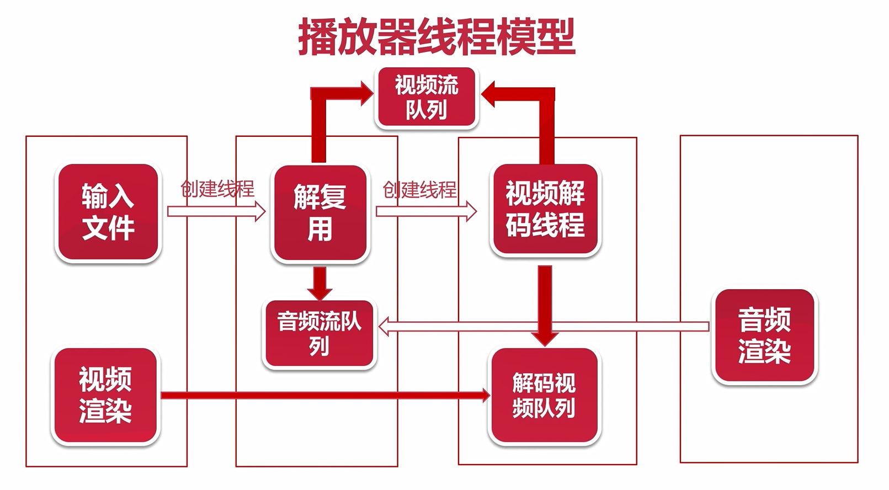
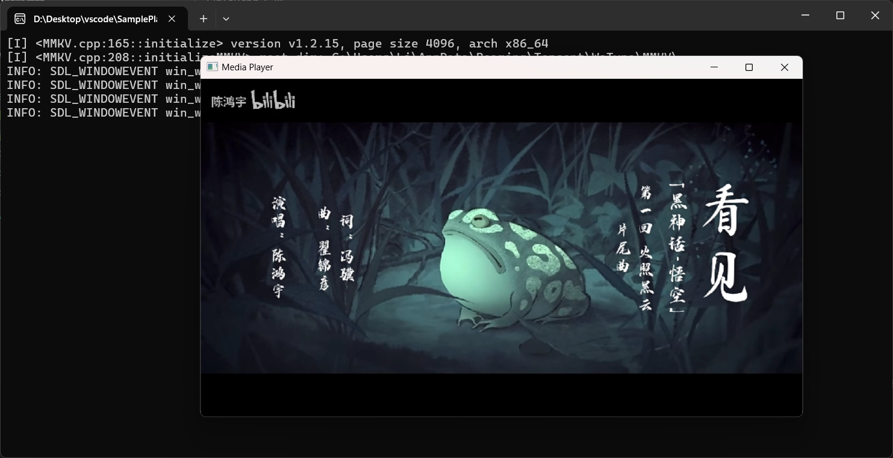
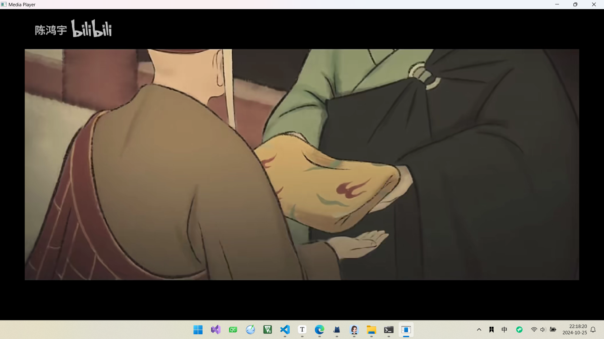

# SimplePlayer

基于FFmpeg 和 SDL 实现的简单播放器。支持播放多种格式的音视频文件。

功能：目前时间有限只实现了部分功能。

- [x] 播放多媒体文件

- [x] 实现音频同步

- [x] 音量🔊加减

- [x] 窗口大小调整

- [x] 退出

- [ ] 快进快退

- [ ] 倍速播放

- [ ] 播放列表

- [ ] 进度条显示、拉动

- [ ] 拉流播放

  

## 播放器线程模型

- **主线程**：负责读取多媒体文件，处理 SDL 事件，并创建解复用线程。在读取文件过程中，确保数据的准确性和完整性。处理 SDL 事件时，能够及时响应用户的操作，如窗口大小调整、音量减低增加等。 

- **解复用线程**：负责初始化音视频流队列，并创建解码线程。通过对音频和视频流的分离和初始化，为后续的解码和播放做好准备。 

- **解码线程**：负责解码音视频数据，并将解码后的数据分别传入音频和视频队列。 

- **视频渲染线程**：负责读取视频队列中的数据，并渲染显示图像。通过比对时间戳与音频播放保持同步 

- **音频回调线程**：负责回调获取音频数据。在播放过程中，确保音频数据的及时获取和播放。 

  

  整个项目参考了 ffplay.c 源码实现，使得音视频同步效果良好最小同步阈值0.01秒，稳定性高。

## 播放效果展示

默认以800:450的大小播放。

全屏播放

上下按键可以调整音量大小

音视频同步效果和声音调节效果

参考：assets目录下的`演示视频.mp3`

<video src="./assets/演示视频.mp4"></video>
